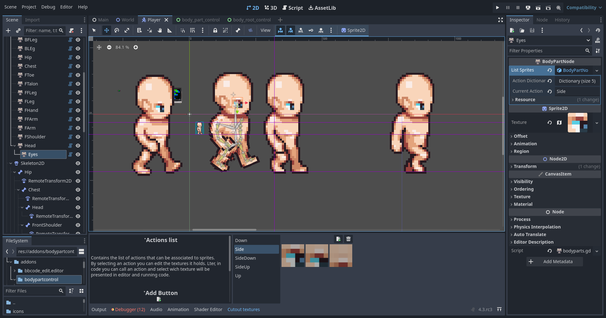
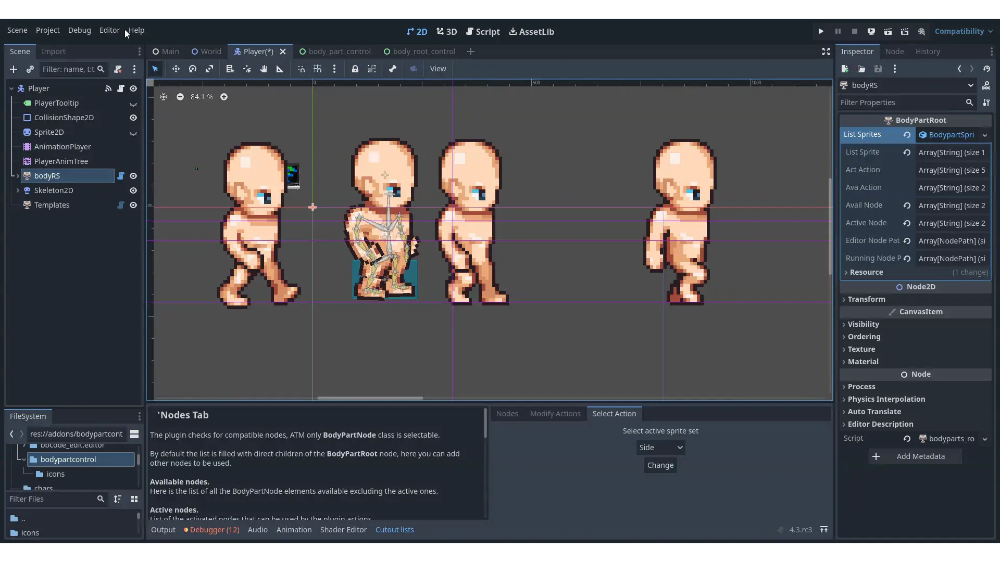

# **Cutout Helper**

**Cutout Animation Helper Plugin**

Frindestown

version=0.1

### [Demo tutorial](https://github.com/Chafalleiro/cutout-plugin-demo)

[Godot Cutout Helper Demo Tutorial - YouTube](https://www.youtube.com/watch?v=-J1b2HQX02E)

### This plugin adds the following to the Editor:

- A custom node wich holds directions of the animation
  and can change the editor cutout parts to ease the animation.
- A custom Sprite2D node wich holds ans process images for the cutout animation.
- A GUI for editing a AtlasTextures for each part and direction, similar to the SpriteFrames GUI.
- It's somehow documented. Classes can be searched in the editor help panel.

### Description.

This plugin helps in organizing a cutout animation using custom nodes for holding images and actions asociated for each set.

It uses two custom nodes BodyPartRoot and BodyPartNode.

**BodyPartRoot** holds a list of the nodes to be used, and a list of "actions" that can be called to modify the sprites stored in the BodyPartNode. Those actions are a way to group call the nodes and can be asociated to several scripts, keypresses and so on at runtime. This node has methods to make group changes to the cutout textures.

In the editor, the actions can be used to ease the process of animating the cutout sprites, selecting an action in the bottom panel asociated with the root node will show and set the textures asociated to that action.

**BodyPartNode** holds sets of textures grouped by action. Each action can hold several textures to later add effects to the cutout part we are animating. This node has methods to make individual changes to the textures.

Although not necesary, setting up a skeleton will help in the animation. You will need to use a **RemoteTransform2D** associating each bone to a **BodyPartNode**. Once the character is set, you can change its appearence and textures by calling an action eihter in Editor via the menu of **BodyPartRoot** or by calling the methods stored into the cutout nodes at runtime.

### Tipical usage.

You first have to add a BodyPartRoot node to store the necesary data.
After that add BodyPartNodes to store and use the sprites that holds the cutout parts.

In the Editor you can change the sprites using the Selection in the "Select Action" tab of the bottom panel used by BodyPartRoot ([CutoutRootControl]).

At runtime you can change the sets of sprites grouped by actions calling the methods in root and nodes.

Use **_BodyPartRoot.setNewSprites()_** to update all the nodes stored in nodes tab list.

Use **_BodypartSpriteList.list_sprites.actAction_** stored actions. You can chek them in the bottom panel of the root node.

### Usage:

     func some_function():
    
        $Name_Of_[BodyPartRoot]_setNewSprites(ActionFromACtAction, index)

### It has the current classes.

Classes with usable nodes.

- BodyPartRoot. Where group manipulation properties and methos are stored.

- BodyPartNode. Where individual texctures and methods are stored.
  
  The following classes are listed as nodes but have no utility out of the plugin scripts.
  They are declared only to be accesible by the help system and as resources.

Resource classes.

- BodyPartNodeRes. Resource that holds textures and the list of activable actions. Each **BodyPartNode** will have one of this.
- BodypartSpriteList. Resource that holds the list of nodes that will be asociated with actions, and methods to make grolup changes to the textures.Each **BodyPartRoot** will have one of this.

Editor plugin classes. Not used at runtime.

- CutOutMain. It controls the bottom panels in editor mode and helps exchanging information between nodes and panels.
- CutoutBottomPanelControl. Panel to manipulate the **BodyPartNode** resources.
- CutoutRootControl. Panel to manipulate the **BodyPartRoot** resources.
